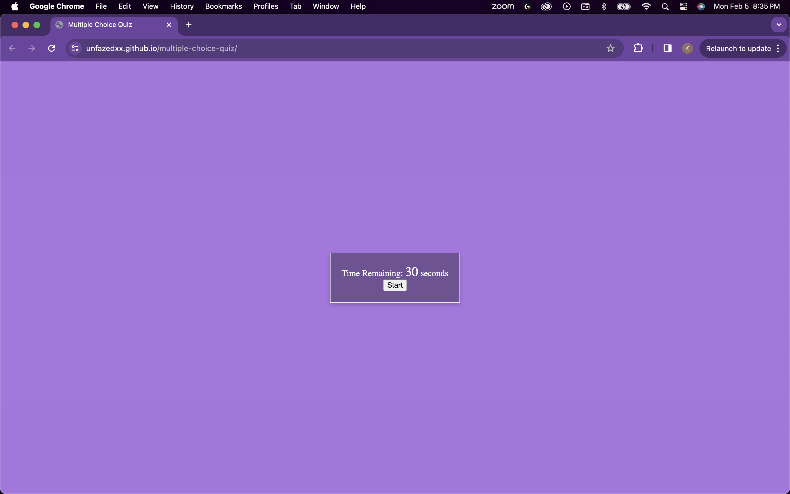
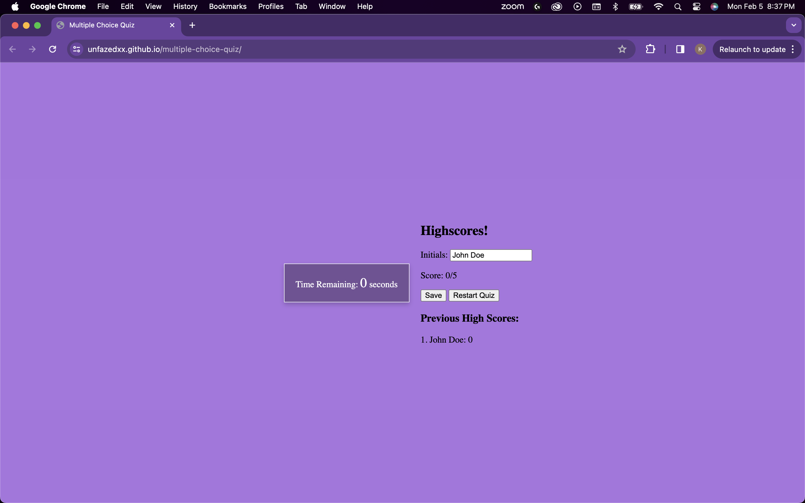

## Multiple Choice Quiz

[](https://opensource.org/licenses/MIT)

## Table of Contents
* [Description](#description)
* [Installation](#installation)
* [Usage](#usage)
* [Technologies](#technologies)
* [Screenshots](#screenshots)
* [License](#license)
* [Author](#author)

## Description

The application is a Multiple choice quiz which tests the user on their knowledge of javascript basics. The code is able to save the users scores into local storage, reduce the timer when an incorrect answer is given, and allow the user to restart the quiz after completed. 

The URL of the GitHub repository is https://github.com/unfazedxx/multiple-choice-quiz

🚀The application has been deployed to Github Pages and the URL of the deployed application is:
https://unfazedxx.github.io/multiple-choice-quiz/


## Installation

- Click the provided Github Pages link 

OR

*  To install this application please follow these directions:

    - Clone the github repository via CLI
    - Right click on the Index.html file, and choose Open with Live Server


        

## Usage

### User Story
```
AS A coding boot camp student
I WANT to take a timed quiz on JavaScript fundamentals that stores high scores
SO THAT I can gauge my progress compared to my peers
```

### Acceptance Criteria 
```
GIVEN I am taking a code quiz
WHEN I click the start button
THEN a timer starts and I am presented with a question
WHEN I answer a question
THEN I am presented with another question
WHEN I answer a question incorrectly
THEN time is subtracted from the clock
WHEN all questions are answered or the timer reaches 0
THEN the game is over
WHEN the game is over
THEN I can save my initials and my score
```


## Technologies
- JavaScript
- HTML 
- CSS
## Screenshots

 


## License

[](https://opensource.org/licenses/MIT)

This project is licensed under the terms of the MIT license.

## Author

I hope you enjoyed this coding quiz application.

If you have further questions or wish to see the other projects I have completed, please visit my Github repository here: [Kunal's Github](https://github.com/unfazedxx).

You can also reach out via email at: 
<a href="mailto:shahkun02@gmail.com">shahkun01@gmail.com</a>

Happy coding 😊
